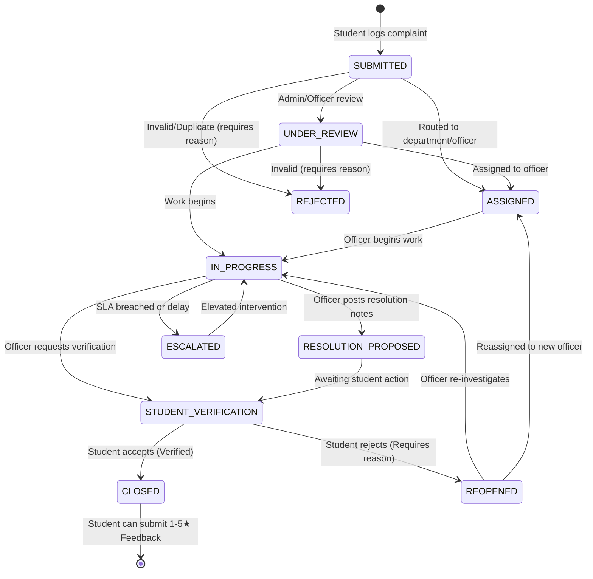

# Backend Contract & Architecture Specification
**Project:** Smart Student Grievance Management System  
**Role:** Backend / Data Engineer (Member 1)  
**Target Audience:** Member 2 (Frontend / Student Experience), Member 3 (AI + Admin Dashboard), QA / Evaluators

---

## 1. System Architecture Overview

The backend is built as a modular, production-ready system utilizing **Next.js 15 App Router API handlers**, **TypeScript (Strict)**, **Zod**, and **Supabase (PostgreSQL + Auth + Storage + RLS)**.

```
                          ┌────────────────────────┐
                          │   Client Applications  │
                          │ (Member 2: Student UI) │
                          │ (Member 3: Admin UI)   │
                          └───────────┬────────────┘
                                      │ HTTP / JSON
                                      ▼
             ┌──────────────────────────────────────────────────┐
             │            Next.js API Route Handlers            │
             │           (Authentication & RBAC Gate)           │
             └───────┬───────────────────────────┬──────────────┘
                     │                           │
                     ▼                           ▼
        ┌─────────────────────────┐ ┌─────────────────────────┐
        │   Domain Engine Layer   │ │   Validation Layer      │
        │ - Deterministic Priority│ │ - Zod DTO Validation    │
        │ - SLA Monitoring Engine │ │ - AI Output Validation  │
        │ - Smart Assignment      │ └─────────────────────────┘
        │ - Lifecycle Transitions │
        │ - Escalation & Audit    │
        └────────────┬────────────┘
                     │
                     ▼
        ┌─────────────────────────────────────────────────────────┐
        │              Supabase PostgreSQL Database               │
        │  - 12 Tables with UUID Primary Keys                     │
        │  - Strict Foreign Keys & State Transitions              │
        │  - Row Level Security (RLS) Policies on Every Table     │
        │  - Auto Ticket Number Generator (GRV-2026-XXXXX)       │
        └─────────────────────────────────────────────────────────┘
```

---

## 2. Roles and Permissions Matrix (RBAC)

The system defines 4 strict user roles (`user_role` enum):

| Role | Scope | Can Submit | Can View | Can Assign | Propose Resolution | Student Verify | View Internal Notes |
| :--- | :--- | :---: | :---: | :---: | :---: | :---: | :---: |
| **`STUDENT`** | Self-only | Yes | Own tickets only | No | No | **Yes** (Accept / Reopen) | **No** |
| **`OFFICER`** | Assigned / Dept | No | Assigned & Dept | No | **Yes** | No | **Yes** |
| **`DEPARTMENT_ADMIN`** | Department-wide | No | Department tickets | **Yes** | **Yes** | No | **Yes** |
| **`SUPER_ADMIN`** | University-wide | No | All tickets | **Yes** | **Yes** | No | **Yes** |

---

## 3. Grievance Status Lifecycle & State Machine

The grievance lifecycle enforces a **closed-loop verification rule**. An officer cannot mark a ticket closed directly; it must progress through `RESOLUTION_PROPOSED` / `STUDENT_VERIFICATION`, where the student confirms resolution or reopens the ticket.



### Invalid Transitions Rejected by Backend:
- `SUBMITTED → CLOSED` : ❌ Rejected (`409 STATE_CONFLICT`)
- `IN_PROGRESS → CLOSED` : ❌ Rejected (Must go through `STUDENT_VERIFICATION`)
- Student transitioning from `IN_PROGRESS` : ❌ Rejected (`403 FORBIDDEN`)
- Student reopening without reason: ❌ Rejected (`400 VALIDATION_ERROR`)

---

## 4. Deterministic Priority Engine & SLA Rules

Priority is **never left to an unpredictable LLM hallucination**. The backend implements a transparent, explainable formula:

### Priority Formula Inputs:
1. **Severity:** `CRITICAL` (+40), `HIGH` (+25), `MODERATE` (+15), `LOW` (+5)
2. **Urgency:** `IMMEDIATE` (+30), `HIGH` (+20), `MEDIUM` (+10), `LOW` (+0)
3. **Cohort Scale:** $\ge 100$ students (+20), $\ge 50$ (+15), $\ge 10$ (+10), $\ge 2$ (+5), 1 student (+0)
4. **Recurrence:** Ongoing/repeated issue (+10)
5. **Safety/Academic Keyword Trigger:** (+10) (e.g., `spark`, `leak`, `water`, `exam`, `contamination`)

### Score Thresholds:
- **$\ge 80$:** `CRITICAL` (SLA: **4 hours**)
- **$60 - 79$:** `HIGH` (SLA: **12 hours**)
- **$35 - 59$:** `MEDIUM` (SLA: **24 hours**)
- **$< 35$:** `LOW` (SLA: **48 hours**)

### SLA Warning & Escalation:
- **At 75% SLA Elapsed:** Triggers warning alert (`SLA_WARNING`) to assigned officer.
- **At 100% SLA Elapsed:** Marks ticket overdue, automatically inserts `grievance_escalations` record, promotes status to `ESCALATED`, and alerts the Department Admin.

---

## 5. Standardized API Envelopes

Every API endpoint returns a predictable envelope format.

### Success Response (`200 OK`, `201 Created`):
```json
{
  "success": true,
  "data": { ... },
  "meta": {
    "page": 1,
    "pageSize": 20,
    "totalCount": 142
  }
}
```

### Error Response (`400`, `401`, `403`, `404`, `409`, `500`):
```json
{
  "success": false,
  "error": {
    "code": "VALIDATION_ERROR",
    "message": "A clear reason is required if rejecting resolution and reopening grievance",
    "details": {
      "reason": ["Please provide a reason of at least 5 characters for reopening"]
    }
  }
}
```

---

## 6. API Endpoints Quick Reference

| Endpoint | Method | Role | Purpose |
| :--- | :--- | :--- | :--- |
| `/api/auth/me` | `GET` | Authenticated | Current user session & profile |
| `/api/departments` | `GET` | Public/Auth | List of active departments |
| `/api/grievances` | `POST` | Student | Submit new complaint |
| `/api/grievances/my` | `GET` | Student | List own complaints with SLA metrics |
| `/api/grievances/:id` | `GET` | Permitted | Single complaint with comments & history |
| `/api/grievances/:id/comments` | `GET` | Permitted | List comments (filtered for student) |
| `/api/grievances/:id/comments` | `POST` | Permitted | Post student or internal officer comment |
| `/api/grievances/:id/verify` | `POST` | Student | Confirm resolution or reopen |
| `/api/grievances/:id/reopen` | `POST` | Student | Reopen grievance with reason |
| `/api/grievances/:id/feedback` | `POST` | Student | Submit 1–5 star rating on CLOSED ticket |
| `/api/grievances/:id/attachments` | `POST` | Permitted | Attach file metadata |
| `/api/admin/grievances` | `GET` | Staff | Administrative grievance list with filters |
| `/api/admin/grievances/:id` | `GET` | Staff | Administrative grievance details |
| `/api/admin/grievances/:id` | `PATCH` | Staff | Update status, priority, or details |
| `/api/admin/grievances/:id/assign` | `POST` | Admin | Assign department / officer |
| `/api/admin/grievances/:id/resolve` | `POST` | Staff | Propose resolution notes |
| `/api/admin/grievances/:id/escalate` | `POST` | Staff | Escalate ticket |
| `/api/admin/analytics/overview` | `GET` | Staff | High-level metrics & SLA compliance |
| `/api/admin/analytics/categories` | `GET` | Staff | Grievances by category |
| `/api/admin/analytics/departments`| `GET` | Staff | Grievances by department |
| `/api/admin/analytics/sla` | `GET` | Staff | SLA compliance and breach counts |
| `/api/admin/analytics/trends` | `GET` | Staff | 14-day submission vs resolution volume |
| `/api/notifications` | `GET` | Authenticated | List user notifications & unread count |
| `/api/notifications/:id/read` | `POST` | Authenticated | Mark notification read |
| `/api/ai/analyze-grievance` | `POST` | Anyone | AI boundary analysis with fallback |

---

## 7. Row Level Security (RLS) Strategy

Row Level Security is enabled on **all 12 PostgreSQL tables**:
1. **`grievances`**:
   - `SELECT`: Allowed if `student_id = auth.uid()` OR caller is `SUPER_ADMIN` OR caller is `DEPARTMENT_ADMIN` of same department OR caller is assigned `OFFICER`.
   - `INSERT`: Students can insert only with `student_id = auth.uid()` and `status = 'SUBMITTED'`.
   - `UPDATE`: Students can only update status when transitioning from `STUDENT_VERIFICATION` to `CLOSED` or `REOPENED`. Staff can update tickets within their department/assigned scope.
2. **`grievance_comments`**:
   - `is_internal = true` comments are filtered out by RLS and API layer for student roles.
3. **`grievance_feedback`**:
   - RLS strictly verifies `EXISTS (SELECT 1 FROM grievances WHERE id = grievance_id AND student_id = auth.uid() AND status = 'CLOSED')`.
4. **`notifications`**:
   - Filtered to `user_id = auth.uid()`.

---

## 8. Integration Instructions for Team Members

### For Member 2 (Frontend / Student Experience)
1. **Authentication:**
   - Use `@supabase/supabase-js` or cookie-based Supabase Auth on the client.
   - For rapid local testing without active Supabase login, add request header `x-demo-user-id: 00000000-0000-0000-0000-000000000006` and `x-demo-user-role: STUDENT`.
2. **Submitting a complaint:**
   - `POST /api/grievances` with `{ title, description, category, affected_students, severity, urgency, recurrence }`.
   - Ticket number and SLA due date are automatically generated and returned.
3. **Student Verification Loop:**
   - When a ticket status is `STUDENT_VERIFICATION`, render the **Accept Resolution** and **Reopen** buttons.
   - Call `POST /api/grievances/:id/verify` with `{ accepted: true }` to close, or `{ accepted: false, reason: "..." }` to reject.
4. **Submitting Feedback:**
   - Call `POST /api/grievances/:id/feedback` with `{ rating: 5, comment: "..." }` once status is `CLOSED`.

### For Member 3 (AI + Admin Dashboard)
1. **AI Analysis Boundary:**
   - Call `POST /api/ai/analyze-grievance` with `{ title, description, category, location, affected_students }`.
   - The endpoint returns `{ analysis: { category, severity, urgency, priority, priorityScore, priorityReasons, department, summary, confidence } }`.
   - Plug your Google Gemini LLM API inside Member 3's route handler or pass your structured output directly to `POST /api/grievances`.
2. **Admin Dashboard Analytics:**
   - Call `/api/admin/analytics/overview`, `/api/admin/analytics/categories`, `/api/admin/analytics/departments`, `/api/admin/analytics/sla`, and `/api/admin/analytics/trends`.
   - All aggregations (overdue counts, breach counts, satisfaction rating, 14-day trends) are pre-calculated server-side for direct chart consumption.
3. **Impersonation Header for Admin Testing:**
   - Add header `x-demo-user-id: 00000000-0000-0000-0000-000000000001` and `x-demo-user-role: SUPER_ADMIN` to test admin views instantly without logging in.
